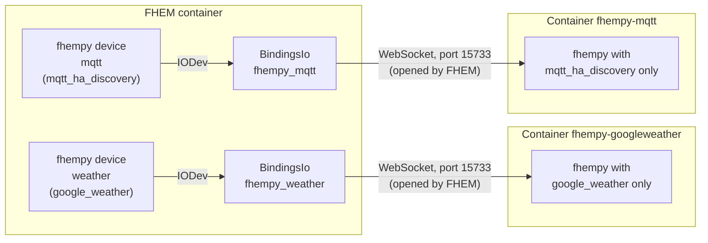

# fhempy-docker
Docker Containers with [fhempy](https://github.com/fhempy/fhempy) which can be connected to [FHEM](https://fhem.de/)

# Every fhempy module comes as a seperate image.
If you want two modules, you have to start two containers.


* Debian trixie
* Python 3.13.15
* fhempy 0.1.764


# How to use with docker-compose

Running fhempy in a docker environment is done by starting the container and connect it within the same network as your fhem container: 
Example is assuming, that your FHEM network is named `net` and already defined as in [fhem-docker](https://github.com/fhem/fhem-docker/blob/dev/docker-compose.yml)

```
  fhempy-googleweather:
    container_name: fhempy-googleweather
    networks:
      - net
    image: ghcr.io/fhem/fhempy-docker_google_weather:1.8.0

  fhempy-mqtt:
    container_name: fhempy-mqtt
    networks:
      - net
    image: ghcr.io/fhem/fhempy-docker_mqtt_ha_discovery:1.8.0
 ```

The image name is `ghcr.io/fhem/fhempy-docker_<module>` (see the table below).
Give every container a fixed name (`container_name`), you need it in the FHEM definition.

To start your container right away:
    
    docker run -d --name fhempy-googleweather ghcr.io/fhem/fhempy-docker_google_weather:1.8.0

# How the containers are connected to FHEM

As noted in the upstream repository, fhempy runs not in the same container as fhem.
So you have to follow, the remote peer setup instructions.



- Every container runs **one** module and listens on port `15733`. FHEM opens the connection to it.
- In FHEM you need **one `BindingsIo` per container**. It only is the connection, it does not know the module.
- The module is chosen by the `fhempy` device (`define <name> fhempy <module> ...`). The attribute `IODev` decides **which container** handles this device.
- Containers only contain the dependencies of their own module and can not install anything at runtime. A device which is handled by the wrong container fails with `Module failed to load: <module> ... No module named '...'`.

Example:
- Containers are named `fhempy-googleweather` and `fhempy-mqtt`
- FHEM and fhempy are on the same network
- Containernames can bei resolved via DNS

In FHEM a `BindingsIo` definition must be defined for each container, pointing to the container name:
```
define fhempy_weather BindingsIo fhempy-googleweather:15733 fhempy
define fhempy_mqtt BindingsIo fhempy-mqtt:15733 fhempy
```

Wait until both devices are in state `opened`, then define the fhempy devices and set `IODev` directly:
```
define weather fhempy google_weather Berlin
attr weather IODev fhempy_weather

define mqtt fhempy mqtt_ha_discovery
attr mqtt IODev fhempy_mqtt
```

Check with `list <device>` that `IODev` is the `BindingsIo` of the right container. If you define the device before the `BindingsIo` is `opened`, the state `fhempy server offline` can stay in the device although the connection works. Check the container log, if you are not sure.

## Automatically created `fhempy_peer_<IP>` devices

fhempy announces itself via mDNS. After the first container is connected, it searches the network for other fhempy containers which are not yet connected to FHEM and creates a `BindingsIo` named `fhempy_peer_<IP>` (with the IP address, not the container name) for each of them.
This is meant for fhempy instances in the same local network, but it is not needed if you define the containers by name:
- If such a peer already exists, defining your own `BindingsIo` for the same container fails with `already defined and using the same port`. Use the peer (you can `rename` it) or define yours first.
- If a container gets a new IP address (e.g. after recreating it), the peer points to whatever container has this IP now. Prefer `BindingsIo` definitions with the container name or use fixed IP addresses.
- Deleting a `BindingsIo` can stop the corresponding container, restart it afterwards.

# Supported Modules and their image

| Module | Image name  |
|------|-------|
| aktionsfinder | ghcr.io/fhem/fhempy-docker_aktionsfinder:1.8.0,ghcr.io/fhem/fhempy-docker_aktionsfinder:1,ghcr.io/fhem/fhempy-docker_aktionsfinder:latest |
| alphaesscloud | ghcr.io/fhem/fhempy-docker_alphaesscloud:1.8.0,ghcr.io/fhem/fhempy-docker_alphaesscloud:1,ghcr.io/fhem/fhempy-docker_alphaesscloud:latest |
| arp_presence | ghcr.io/fhem/fhempy-docker_arp_presence:1.8.0,ghcr.io/fhem/fhempy-docker_arp_presence:1,ghcr.io/fhem/fhempy-docker_arp_presence:latest |
| ble_monitor | ghcr.io/fhem/fhempy-docker_ble_monitor:1.8.0,ghcr.io/fhem/fhempy-docker_ble_monitor:1,ghcr.io/fhem/fhempy-docker_ble_monitor:latest |
| ble_presence | ghcr.io/fhem/fhempy-docker_ble_presence:1.8.0,ghcr.io/fhem/fhempy-docker_ble_presence:1,ghcr.io/fhem/fhempy-docker_ble_presence:latest |
| ble_reset | ghcr.io/fhem/fhempy-docker_ble_reset:1.8.0,ghcr.io/fhem/fhempy-docker_ble_reset:1,ghcr.io/fhem/fhempy-docker_ble_reset:latest |
| blue_connect | ghcr.io/fhem/fhempy-docker_blue_connect:1.8.0,ghcr.io/fhem/fhempy-docker_blue_connect:1,ghcr.io/fhem/fhempy-docker_blue_connect:latest |
| bt_presence | ghcr.io/fhem/fhempy-docker_bt_presence:1.8.0,ghcr.io/fhem/fhempy-docker_bt_presence:1,ghcr.io/fhem/fhempy-docker_bt_presence:latest |
| ddnssde | ghcr.io/fhem/fhempy-docker_ddnssde:1.8.0,ghcr.io/fhem/fhempy-docker_ddnssde:1,ghcr.io/fhem/fhempy-docker_ddnssde:latest |
| discover_ble | ghcr.io/fhem/fhempy-docker_discover_ble:1.8.0,ghcr.io/fhem/fhempy-docker_discover_ble:1,ghcr.io/fhem/fhempy-docker_discover_ble:latest |
| discover_mdns | ghcr.io/fhem/fhempy-docker_discover_mdns:1.8.0,ghcr.io/fhem/fhempy-docker_discover_mdns:1,ghcr.io/fhem/fhempy-docker_discover_mdns:latest |
| discover_upnp | ghcr.io/fhem/fhempy-docker_discover_upnp:1.8.0,ghcr.io/fhem/fhempy-docker_discover_upnp:1,ghcr.io/fhem/fhempy-docker_discover_upnp:latest |
| dlna_dmr | ghcr.io/fhem/fhempy-docker_dlna_dmr:1.8.0,ghcr.io/fhem/fhempy-docker_dlna_dmr:1,ghcr.io/fhem/fhempy-docker_dlna_dmr:latest |
| energie_gv_at | ghcr.io/fhem/fhempy-docker_energie_gv_at:1.8.0,ghcr.io/fhem/fhempy-docker_energie_gv_at:1,ghcr.io/fhem/fhempy-docker_energie_gv_at:latest |
| eq3bt | ghcr.io/fhem/fhempy-docker_eq3bt:1.8.0,ghcr.io/fhem/fhempy-docker_eq3bt:1,ghcr.io/fhem/fhempy-docker_eq3bt:latest |
| erelax_vaillant | ghcr.io/fhem/fhempy-docker_erelax_vaillant:1.8.0,ghcr.io/fhem/fhempy-docker_erelax_vaillant:1,ghcr.io/fhem/fhempy-docker_erelax_vaillant:latest |
| esphome | ghcr.io/fhem/fhempy-docker_esphome:1.8.0,ghcr.io/fhem/fhempy-docker_esphome:1,ghcr.io/fhem/fhempy-docker_esphome:latest |
| fhem_forum | ghcr.io/fhem/fhempy-docker_fhem_forum:1.8.0,ghcr.io/fhem/fhempy-docker_fhem_forum:1,ghcr.io/fhem/fhempy-docker_fhem_forum:latest |
| fusionsolar | ghcr.io/fhem/fhempy-docker_fusionsolar:1.8.0,ghcr.io/fhem/fhempy-docker_fusionsolar:1,ghcr.io/fhem/fhempy-docker_fusionsolar:latest |
| geizhals | ghcr.io/fhem/fhempy-docker_geizhals:1.8.0,ghcr.io/fhem/fhempy-docker_geizhals:1,ghcr.io/fhem/fhempy-docker_geizhals:latest |
| gfprobt | ghcr.io/fhem/fhempy-docker_gfprobt:1.8.0,ghcr.io/fhem/fhempy-docker_gfprobt:1,ghcr.io/fhem/fhempy-docker_gfprobt:latest |
| github_backup | ghcr.io/fhem/fhempy-docker_github_backup:1.8.0,ghcr.io/fhem/fhempy-docker_github_backup:1,ghcr.io/fhem/fhempy-docker_github_backup:latest |
| github_restore | ghcr.io/fhem/fhempy-docker_github_restore:1.8.0,ghcr.io/fhem/fhempy-docker_github_restore:1,ghcr.io/fhem/fhempy-docker_github_restore:latest |
| goodwe | ghcr.io/fhem/fhempy-docker_goodwe:1.8.0,ghcr.io/fhem/fhempy-docker_goodwe:1,ghcr.io/fhem/fhempy-docker_goodwe:latest |
| google_weather | ghcr.io/fhem/fhempy-docker_google_weather:1.8.0,ghcr.io/fhem/fhempy-docker_google_weather:1,ghcr.io/fhem/fhempy-docker_google_weather:latest |
| googlecast | ghcr.io/fhem/fhempy-docker_googlecast:1.8.0,ghcr.io/fhem/fhempy-docker_googlecast:1,ghcr.io/fhem/fhempy-docker_googlecast:latest |
| gree_climate | ghcr.io/fhem/fhempy-docker_gree_climate:1.8.0,ghcr.io/fhem/fhempy-docker_gree_climate:1,ghcr.io/fhem/fhempy-docker_gree_climate:latest |
| helloworld | ghcr.io/fhem/fhempy-docker_helloworld:1.8.0,ghcr.io/fhem/fhempy-docker_helloworld:1,ghcr.io/fhem/fhempy-docker_helloworld:latest |
| homekit | ghcr.io/fhem/fhempy-docker_homekit:1.8.0,ghcr.io/fhem/fhempy-docker_homekit:1,ghcr.io/fhem/fhempy-docker_homekit:latest |
| huawei_modbus | ghcr.io/fhem/fhempy-docker_huawei_modbus:1.8.0,ghcr.io/fhem/fhempy-docker_huawei_modbus:1,ghcr.io/fhem/fhempy-docker_huawei_modbus:latest |
| ikos | ghcr.io/fhem/fhempy-docker_ikos:1.8.0,ghcr.io/fhem/fhempy-docker_ikos:1,ghcr.io/fhem/fhempy-docker_ikos:latest |
| kia_hyundai | ghcr.io/fhem/fhempy-docker_kia_hyundai:1.8.0,ghcr.io/fhem/fhempy-docker_kia_hyundai:1,ghcr.io/fhem/fhempy-docker_kia_hyundai:latest |
| meross | ghcr.io/fhem/fhempy-docker_meross:1.8.0,ghcr.io/fhem/fhempy-docker_meross:1,ghcr.io/fhem/fhempy-docker_meross:latest |
| miflora | ghcr.io/fhem/fhempy-docker_miflora:1.8.0,ghcr.io/fhem/fhempy-docker_miflora:1,ghcr.io/fhem/fhempy-docker_miflora:latest |
| miio | ghcr.io/fhem/fhempy-docker_miio:1.8.0,ghcr.io/fhem/fhempy-docker_miio:1,ghcr.io/fhem/fhempy-docker_miio:latest |
| miscale | ghcr.io/fhem/fhempy-docker_miscale:1.8.0,ghcr.io/fhem/fhempy-docker_miscale:1,ghcr.io/fhem/fhempy-docker_miscale:latest |
| mitemp2 | ghcr.io/fhem/fhempy-docker_mitemp2:1.8.0,ghcr.io/fhem/fhempy-docker_mitemp2:1,ghcr.io/fhem/fhempy-docker_mitemp2:latest |
| mitemp | ghcr.io/fhem/fhempy-docker_mitemp:1.8.0,ghcr.io/fhem/fhempy-docker_mitemp:1,ghcr.io/fhem/fhempy-docker_mitemp:latest |
| mqtt_ha_discovery | ghcr.io/fhem/fhempy-docker_mqtt_ha_discovery:1.8.0,ghcr.io/fhem/fhempy-docker_mqtt_ha_discovery:1,ghcr.io/fhem/fhempy-docker_mqtt_ha_discovery:latest |
| nefit | ghcr.io/fhem/fhempy-docker_nefit:1.8.0,ghcr.io/fhem/fhempy-docker_nefit:1,ghcr.io/fhem/fhempy-docker_nefit:latest |
| nespresso_ble | ghcr.io/fhem/fhempy-docker_nespresso_ble:1.8.0,ghcr.io/fhem/fhempy-docker_nespresso_ble:1,ghcr.io/fhem/fhempy-docker_nespresso_ble:latest |
| piclock | ghcr.io/fhem/fhempy-docker_piclock:1.8.0,ghcr.io/fhem/fhempy-docker_piclock:1,ghcr.io/fhem/fhempy-docker_piclock:latest |
| prusalink | ghcr.io/fhem/fhempy-docker_prusalink:1.8.0,ghcr.io/fhem/fhempy-docker_prusalink:1,ghcr.io/fhem/fhempy-docker_prusalink:latest |
| pyit600 | ghcr.io/fhem/fhempy-docker_pyit600:1.8.0,ghcr.io/fhem/fhempy-docker_pyit600:1,ghcr.io/fhem/fhempy-docker_pyit600:latest |
| rct_power | ghcr.io/fhem/fhempy-docker_rct_power:1.8.0,ghcr.io/fhem/fhempy-docker_rct_power:1,ghcr.io/fhem/fhempy-docker_rct_power:latest |
| ring | ghcr.io/fhem/fhempy-docker_ring:1.8.0,ghcr.io/fhem/fhempy-docker_ring:1,ghcr.io/fhem/fhempy-docker_ring:latest |
| seatconnect | ghcr.io/fhem/fhempy-docker_seatconnect:1.8.0,ghcr.io/fhem/fhempy-docker_seatconnect:1,ghcr.io/fhem/fhempy-docker_seatconnect:latest |
| skodaconnect | ghcr.io/fhem/fhempy-docker_skodaconnect:1.8.0,ghcr.io/fhem/fhempy-docker_skodaconnect:1,ghcr.io/fhem/fhempy-docker_skodaconnect:latest |
| spotify | ghcr.io/fhem/fhempy-docker_spotify:1.8.0,ghcr.io/fhem/fhempy-docker_spotify:1,ghcr.io/fhem/fhempy-docker_spotify:latest |
| tibber | ghcr.io/fhem/fhempy-docker_tibber:1.8.0,ghcr.io/fhem/fhempy-docker_tibber:1,ghcr.io/fhem/fhempy-docker_tibber:latest |
| tuya_cloud | ghcr.io/fhem/fhempy-docker_tuya_cloud:1.8.0,ghcr.io/fhem/fhempy-docker_tuya_cloud:1,ghcr.io/fhem/fhempy-docker_tuya_cloud:latest |
| tuya | ghcr.io/fhem/fhempy-docker_tuya:1.8.0,ghcr.io/fhem/fhempy-docker_tuya:1,ghcr.io/fhem/fhempy-docker_tuya:latest |
| tuya_smartlife | ghcr.io/fhem/fhempy-docker_tuya_smartlife:1.8.0,ghcr.io/fhem/fhempy-docker_tuya_smartlife:1,ghcr.io/fhem/fhempy-docker_tuya_smartlife:latest |
| volvo | ghcr.io/fhem/fhempy-docker_volvo:1.8.0,ghcr.io/fhem/fhempy-docker_volvo:1,ghcr.io/fhem/fhempy-docker_volvo:latest |
| volvo_software_update | ghcr.io/fhem/fhempy-docker_volvo_software_update:1.8.0,ghcr.io/fhem/fhempy-docker_volvo_software_update:1,ghcr.io/fhem/fhempy-docker_volvo_software_update:latest |
| warema | ghcr.io/fhem/fhempy-docker_warema:1.8.0,ghcr.io/fhem/fhempy-docker_warema:1,ghcr.io/fhem/fhempy-docker_warema:latest |
| websitetests | ghcr.io/fhem/fhempy-docker_websitetests:1.8.0,ghcr.io/fhem/fhempy-docker_websitetests:1,ghcr.io/fhem/fhempy-docker_websitetests:latest |
| wienerlinien | ghcr.io/fhem/fhempy-docker_wienerlinien:1.8.0,ghcr.io/fhem/fhempy-docker_wienerlinien:1,ghcr.io/fhem/fhempy-docker_wienerlinien:latest |
| wienernetze_smartmeter | ghcr.io/fhem/fhempy-docker_wienernetze_smartmeter:1.8.0,ghcr.io/fhem/fhempy-docker_wienernetze_smartmeter:1,ghcr.io/fhem/fhempy-docker_wienernetze_smartmeter:latest |
| xiaomi_gateway3_device | ghcr.io/fhem/fhempy-docker_xiaomi_gateway3_device:1.8.0,ghcr.io/fhem/fhempy-docker_xiaomi_gateway3_device:1,ghcr.io/fhem/fhempy-docker_xiaomi_gateway3_device:latest |
| xiaomi_gateway3 | ghcr.io/fhem/fhempy-docker_xiaomi_gateway3:1.8.0,ghcr.io/fhem/fhempy-docker_xiaomi_gateway3:1,ghcr.io/fhem/fhempy-docker_xiaomi_gateway3:latest |
| xiaomi_tokens | ghcr.io/fhem/fhempy-docker_xiaomi_tokens:1.8.0,ghcr.io/fhem/fhempy-docker_xiaomi_tokens:1,ghcr.io/fhem/fhempy-docker_xiaomi_tokens:latest |
| zappi | ghcr.io/fhem/fhempy-docker_zappi:1.8.0,ghcr.io/fhem/fhempy-docker_zappi:1,ghcr.io/fhem/fhempy-docker_zappi:latest |
| zigbee2mqtt | ghcr.io/fhem/fhempy-docker_zigbee2mqtt:1.8.0,ghcr.io/fhem/fhempy-docker_zigbee2mqtt:1,ghcr.io/fhem/fhempy-docker_zigbee2mqtt:latest |
